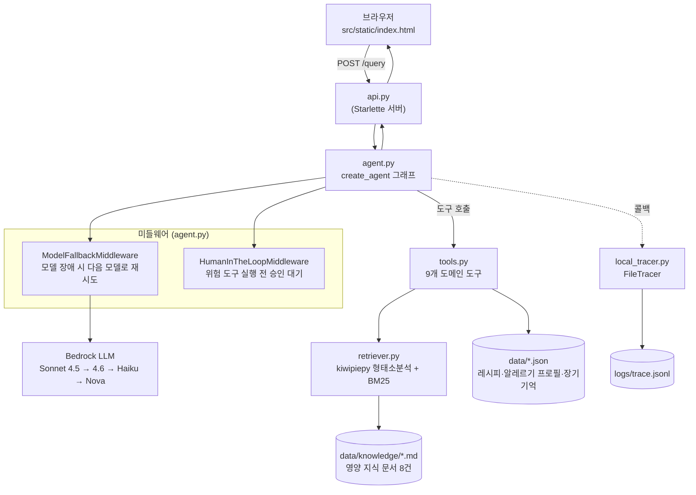

# 미니 PJT: [키즈밀플래너]

## 무엇을 푸나
매일 아이 뭐먹일지 고민하는 시간 없는 부모들을 위해 아이의 영양 상태와 알레르기 냉장고의 재고를 확인해서 식사 메뉴를 추천.

## 활용한 패턴 (Day 1~7)
- Day 3: ReAct (도구 자율 선택) - 9개의 도구로 agent가 선택하도록 함
- Day 2: Rag — retriever 로 영양정보 문서를 근거로 답변
- Day 5: HITL - 3일치 식단표 문서로 출력할 때 사용자의 결정 대기
- Day 5: 미들웨어 - 모델 장애 시 자동 재시도
- Day 7: 장기기억 - 아이의 알러지 기록을 장기기억화
- Day 7: Observability · Trace - trace 반영
- Day 7: RAGAS - 자체 평가 세트로 지표 산출

## 아키텍처



**요청 처리 흐름**

1. 브라우저가 `POST /query`로 `{"question": "..."}`을 보낸다 (`src/api.py`).
2. `api.py`는 현재 스레드가 승인 대기 중인지(`graph.get_state(...).interrupts`) 먼저 확인하고, 아니면 `agent.handle_query()`를 호출한다.
3. `agent.py`의 `create_agent` 그래프가 ReAct 루프를 돈다: LLM이 필요한 도구를 스스로 선택 → `ModelFallbackMiddleware`가 모델 호출을 감싸 실패 시 다음 모델로 재시도 → `tools.py`의 도구가 실행되고 `data/*.json`(레시피·알레르기·장기 기억)을 읽고 쓴다.
4. 영양 지식 질문이면 `search_recipe` 대신 `search_nutrition_guidelines`가 호출되어 `retriever.py`(kiwipiepy 형태소분석 + BM25)가 `data/knowledge/*.md`에서 근거 문서를 찾아온다.
5. `save_meal_plan_to_file`·`override_preference_constraint`처럼 위험한 도구가 호출되면 `HumanInTheLoopMiddleware`가 그래프를 `pending_approval` 상태로 멈춘다. `api.py`는 다음 요청의 `question`이 `y`/`n`이면 같은 `thread_id`로 그래프를 재개한다(2턴 승인 흐름).
6. 이 모든 LLM·도구 호출은 `graph.invoke`의 `config={"callbacks": [...]}`을 통해 `local_tracer.py`의 `FileTracer`로 전파되어 `logs/trace.jsonl`에 한 줄씩 기록된다 (외부 서버 없이 로컬 파일로만).
7. 최종적으로 `agent.py`는 `{"answer", "contexts", "trace"}`를 조립해 `api.py` → 브라우저로 돌려준다.

## 실행 방법

```bash
# 1. 가상환경 생성 및 패키지 설치
python -m venv .venv
.venv\Scripts\activate       # Windows
pip install -r requirements.txt

# 2. .env 파일 생성 (프로젝트 루트, git에는 커밋되지 않음)
```

`.env`에 필요한 값:

```
AWS_ACCESS_KEY_ID=...
AWS_SECRET_ACCESS_KEY=...
AWS_DEFAULT_REGION=us-east-1
```

```bash
# 3. 서버 실행
cd src
python -m uvicorn api:app --reload
```

브라우저에서 `http://127.0.0.1:8000` 접속하면 채팅 화면이 뜬다. 실행 중 모든 LLM·도구 호출은 `logs/trace.jsonl`에 자동으로 기록된다.

**평가 재실행**: `evaluation/test_queries.csv`를 읽어 각 케이스를 `agent.handle_query(question, thread_id=...)`로 돌리는 스크립트를 직접 작성해 실행한다(현재 저장소에는 평가 러너 스크립트가 커밋되어 있지 않고, 결과 판정도 수작업이다 — 아래 한계 참고).

## RAGAS 평가 결과

`evaluation/run_ragas.py`로 실제 RAGAS를 붙였다. `data/knowledge/*.md` 8개 문서에 1:1 대응하는 질문 8건을 실제 에이전트(`agent.handle_query`)로 돌려 답변·근거 문서를 얻고, judge LLM은 우리가 쓰는 Bedrock Claude를, 임베딩은 Bedrock Titan Embed v2를 그대로 재사용해 계산했다 — 외부 서비스(OpenAI 등) 추가 없이 기존 인프라만 썼다.

**결과가 부분적이다 — 표본 크기를 그대로 밝힌다.** 이 프로젝트 전체에서 반복적으로 겪은 Bedrock 계정의 "하루 토큰 총량" 한도에 RAGAS 실행 중(지표 하나당 judge LLM을 여러 번 호출) 다시 걸려서, 8건 전부가 확보된 지표가 없다. 동시 실행 수를 1로 낮춰 순차 실행으로 재시도했지만 개선되지 않았다 — 즉 이건 초당/분당 요청 제한이 아니라 진짜 일일 총량 캡이라는 뜻이다.

| 지표 | 확보된 표본 | 값 |
|---|---|---|
| context_recall | 4 / 8 | 1.0 |
| context_precision | 2 / 8 | 1.0 |
| faithfulness | 0 / 8 (배치 실행 기준) | 미확보 — 단, 별도 1문항 사전 테스트에서 **0.9048** 실측 |
| answer_relevancy | 0 / 8 | 미확보 |

원본 데이터(질문별 답변·근거 문서·지표값)는 [evaluation/ragas_results.json](evaluation/ragas_results.json)에 그대로 있다.

**재실행 방법**: 계정 할당량이 풀린 뒤 `python evaluation/run_ragas.py`를 다시 실행하면 된다. 이미 확보한 답변·근거 문서는 `ragas_results.json`에 캐시되어 있어 에이전트를 다시 호출하지 않고 지표 계산만 재시도하며, 이전에 성공한 지표값은 다음 실행에서 실패해도 덮어쓰이지 않고 보존된다.

## 인-아웃 세트 통과율 (자체 평가)

20건(positive 8 · negative 4 · edge 5 · guardrail 3) 기준. Day 번호는 실제 실행일(2026-09-17)에 맞춰 확인 필요.

- **1차 (최초 실행)**: 15 / 20 통과, 4건 결함 발견(그중 1건 치명적 — id=17, 멸치 알레르기 아동에게 멸치육수 메뉴 제안), 1건은 테스트 설계 한계로 미검증(id=6, HITL)
- **2차 (시스템 프롬프트 수정 후 표적 재검증)**: 실패한 4건만 재실행해 4 / 4 통과. 전체 20건 재실행은 아직 안 함
- **개선폭**: +4건 (14 → 18건 확정 통과, 1건은 여전히 미검증)
- **주요 개선 사항**: (1) 정식 추천이 아닌 조언성 답변에서도 알레르기 프로필과 대조하도록 지시 추가 (2) `generate_meal_plan_table` 결과를 요약만 하지 말고 답변에 그대로 포함하도록 지시 (3) 냉장고가 비어도 일반 검색으로 진행하도록 지시 (4) DB에 없는 재료는 "없다"고 명확히 답하도록 지시

상세 내역: [round1_report.md](evaluation/round1_report.md)

## 트라이앤에러 회고

**시도했지만 바꾼 접근**

- **RAG 검색: sklearn TF-IDF(문자 n-gram) → kiwipiepy + BM25.** 처음엔 형태소 분석기 없이 char n-gram으로 한국어 조사 문제를 우회했는데, 실제 프로젝트 `.venv`에 이미 `kiwipiepy`·`rank-bm25`가 준비돼 있다는 걸 뒤늦게 발견해서 전면 재작성했다. 코드부터 짜기 전에 실제 환경(`requirements.txt`, 설치된 패키지)을 먼저 확인했어야 했다.
- **알레르기 판정 기준: 식약처 표시 대상 19종 → 사용자 정의 프로필.** 처음엔 일반적인 규제 목록으로 설계했다가, "우리 아이만의 알레르기"가 기준이어야 한다는 요구로 스키마를 통째로 바꿨다. `allergen_map.json`(재료→성분 사전, 서비스 제공)과 `allergy_profile.json`(무엇을 피해야 하는지, 사용자 작성)을 분리한 게 이 과정에서 나온 결정이다.
- **알레르기 우회 도구: `override_allergen_conflict` → `override_preference_constraint`.** 처음엔 "승인만 받으면 알레르기 메뉴도 강제 포함" 도구를 뒀는데, 이게 "알레르기 무관용" 정책과 정면 충돌한다는 걸 검토 중 발견하고, 편식·선호 제약만 해제 가능하도록(알레르기는 코드 레벨에서 아예 우회 불가) 바꿨다.
- **Observability: LangSmith → 로컬 FileTracer.** 외부 서버 의존 없이 트레이스를 남기기 위해 `LANGSMITH_*` 환경변수 방식을 걷어내고, `local_tracer.py`의 콜백 핸들러를 `graph.invoke`의 `config.callbacks`로 연결하는 방식으로 교체했다.

**최종 채택한 접근**

- `create_agent`(langchain 1.x) + `ModelFallbackMiddleware`(모델 장애 시 9개 모델 순차 재시도) + `HumanInTheLoopMiddleware`(위험 도구 승인 대기) 조합으로 ReAct·HITL을 한 그래프 안에서 처리
- 알레르기 판정은 항상 재료를 구성 성분 단위까지 펼쳐서(`check_allergen`) 검사하고, `allergy_profile.json`은 에이전트가 절대 쓰기 못 하게 설계(읽기 전용 도구만 제공)
- 20건 인-아웃 세트를 실제 Bedrock 호출로 돌려 사람이 직접 판정 — 자동 채점 스크립트는 아직 없음

**남은 한계 · 향후 개선 방향**

1. HITL 2턴(식단표 생성 → 저장 승인) 흐름이 독립 스레드 평가 설계 때문에 아직 실측 안 됨 — 같은 스레드로 2턴짜리 스모크 테스트 필요
2. RAGAS 미구현 — RAG 품질의 정량 지표(context_recall 등)가 없음
3. ReAct 재검색(알레르기 충돌 시 `search_recipe`를 조건 바꿔 재호출)이 설계한 대로 항상 발동하진 않고, 모델이 도구 재호출 없이 서술로 대체하는 경우가 있었음(id=15)
4. 다자녀 지원·제철 재료 가산점은 SERVICE.md에 설계만 해두고 v1에서는 구현하지 않음
5. HITL 체크포인터가 `InMemorySaver`라 서버 재시작 시 승인 대기 상태가 사라짐 — 운영 배포 시 `langgraph-checkpoint-sqlite` 등으로 교체 필요

## 핵심 코드 위치

**`src/agent.py`** — 메인 에이전트 그래프
- [`SYSTEM_PROMPT`](src/agent.py#L94) — 도구 사용 전략·안전 규칙
- [`graph = create_agent(...)`](src/agent.py#L159) — 그래프 조립
- [`ModelFallbackMiddleware(...)`](src/agent.py#L167) — 모델 장애 시 자동 재시도
- [`HumanInTheLoopMiddleware(...)`](src/agent.py#L168) — 위험 도구 승인 대기 (HITL)
- [`handle_query()`](src/agent.py#L215) — `POST /query`가 호출하는 진입점

**`src/tools.py`** — 도메인 도구
- [`_excluded_ingredient_ids()`](src/tools.py#L73) — 알레르기 프로필을 성분 단위로 펼쳐 제외 재료 계산
- [`get_household_memory()`](src/tools.py#L108) / [`get_allergy_profile()`](src/tools.py#L121) — 장기 기억 조회 (읽기 전용)
- [`update_household_memory()`](src/tools.py#L145) — 장기 기억 갱신 (알레르기 필드 없음)
- [`search_recipe()`](src/tools.py#L234) / [`check_allergen()`](src/tools.py#L292) — 레시피 검색·안전성 검증
- [`search_nutrition_guidelines()`](src/tools.py#L335) — RAG 도구 (retriever.py 래핑)
- [`generate_meal_plan_table()`](src/tools.py#L356) / [`save_meal_plan_to_file()`](src/tools.py#L392) — 식단표 생성·저장 (저장은 HITL 대상)
- [`override_preference_constraint()`](src/tools.py#L408) — 편식 제약 해제 (HITL 대상, 알레르기는 코드 레벨에서 우회 불가)

**`src/retriever.py`** — RAG 파이프라인
- [`_tokenize()`](src/retriever.py#L33) — kiwipiepy 형태소 분석 + 내용어 필터링
- [`NutritionRetriever`](src/retriever.py#L73) / [`.search()`](src/retriever.py#L87) — BM25 검색, `min_score=2.0`
- [`search_nutrition_guidelines()`](src/retriever.py#L130) — 모듈 공개 진입점

**`src/api.py`** — 웹 서버
- [`_pending_action_requests()`](src/api.py#L30) — 승인 대기 상태 조회
- [`query_endpoint()`](src/api.py#L39) — `POST /query` 핸들러, y/n → approve/reject 변환

**`src/local_tracer.py`** — Observability/Trace
- `FileTracer` — LLM·도구 호출을 `logs/trace.jsonl`에 기록하는 콜백 핸들러 (외부 서버 미사용)

**`evaluation/run_ragas.py`** — RAGAS 평가 스크립트
- `CASES` — 지식 문서 8건에 대응하는 질문 + ground truth
- `main()` — 에이전트 호출 결과 캐싱 → 지표 4개를 순차 실행 → 실행마다 즉시 저장 (부분 실패에도 이전 성공값 보존)